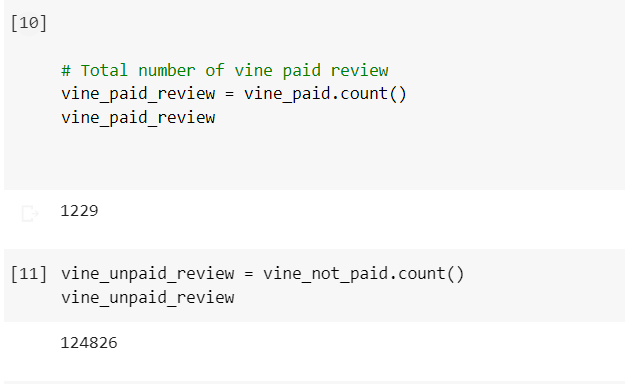
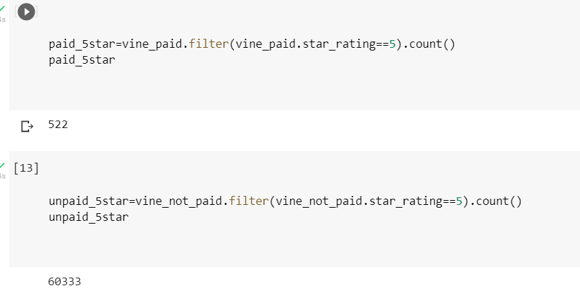
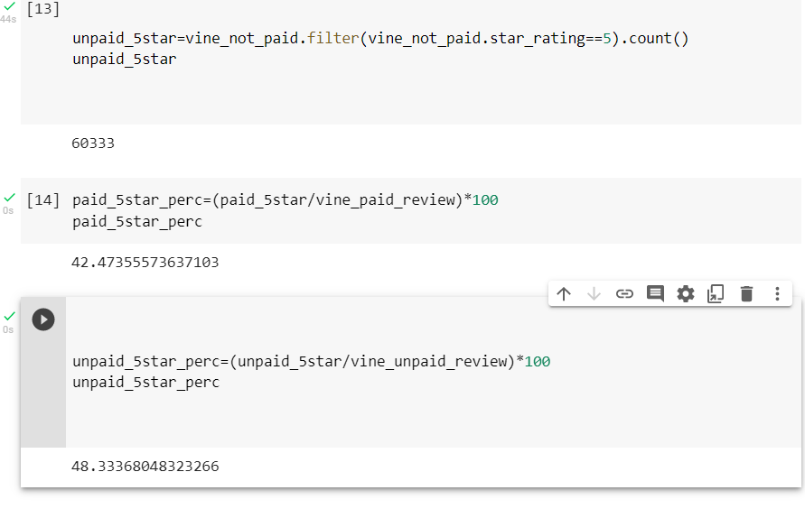

# Amazon_Vine_Analysis
## Introduction
Ever wonder how to determine bias from reviews? This project answers that very question. Over fifty datasets of shoe review were utilized for this analysis .**This project utilizes ETL, AWS RDS, pgAdmin, PySpark, Pandas, and SQL to determine bias in review from Vine members in the shoe dataset.** 
## Results
These results answer three main questions as follows.
1)	How many Vine reviews and non-Vine reviews were there?
Answer: 1229 vine reviews and 124826 non-vine reviews.

2)	How many Vine reviews were 5 stars? How many non-Vine reviews were 5 stars?
Answer: 522 vine reviews with 5-stars and 60333 non-vine reviews with 5 stars.

3)	What percentage of Vine reviews were 5 stars? What percentage of non-Vine reviews were 5 stars?
Answer: 42% of Vine reviews were five stars and 48% of non-Vine review were 5 stars.

## Summary
Biased on the result it is evident the there are much more non-paid Vine users than paid Vine users, thus there is no bias towards paid Vine users. The former conclusion is evidenced by the percentage of Vine reviews, which are similar between the two groups. However, in order to confirm this observation I suggest looking at the average deviation of each dataset which will easily show outliers in the data. 
 
